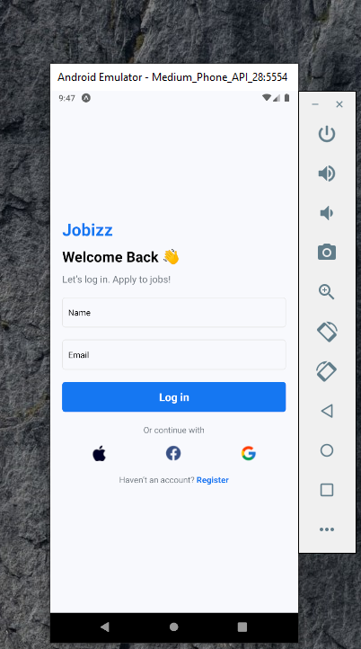
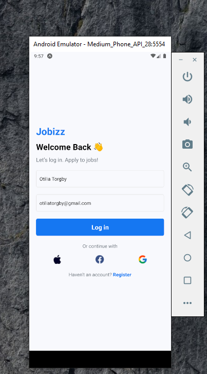
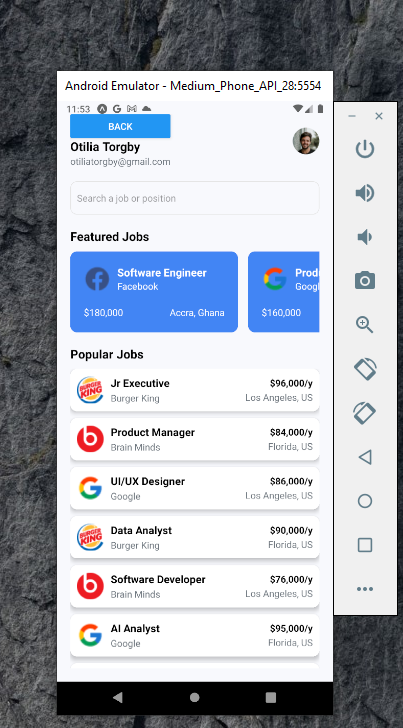
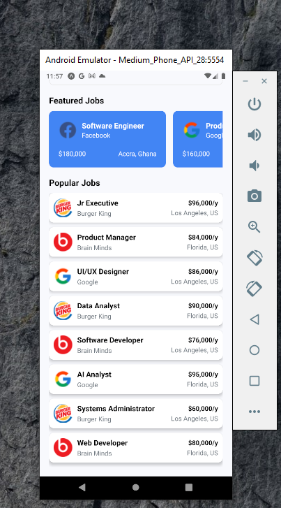

# rn-assignment4-11083414

## STUDENT ID: 11083414

## Third React Native Project

### This is a simple React Native project that displays a Login Screen and a Home Screen.

## Here's a brief overview of the project:

## Project Description:

### This project uses the React Native framework to create a mobile application that runs on both iOS and Android devices. The application consists of two screens that displays a login page and home page (user's page). 

## Components' Description

### The project includes the following components:
- `LoginScreen.js`: 
  
  This component displays a login form with input fields for username and email.

- `HomeScreen.js`:
  
  This component displays a welcome message with the user's name and email, a list of available jobs
  and a logout button that navigates back to the login screen.

- `FeaturedCard.js`:
  
  This component displays attractive or selected job items with its title, description,loacation, salary and a button to apply for
  the job.

- `PopularCard.js`:
  
  This component displays job items with its title, description,loacation, salary and a button to apply for the job.

- `App.js`:

    This is the main component that handles navigation between the login and home screens using React Navigation.

- `assets`:

    This folder contains the images used in the project.

- `READDME.md`:

    This file contains the project description and components in the project.

## Application Screenshots

